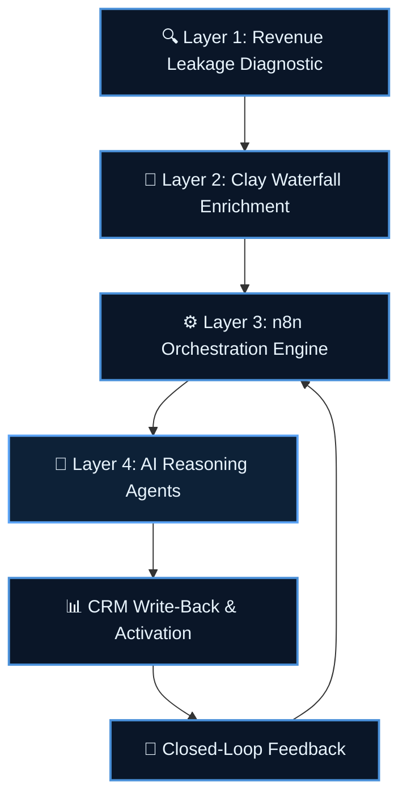

# Neural-GTM Sprint
### A 72-Hour Agentic Revenue Automation Deployment | by myAutoBots.AI

> **Stop losing pipeline to manual ops.** The Neural-GTM Sprint is a fixed-scope, fixed-price engagement that audits your B2B revenue stack, identifies every leakage point with dollar quantification, and deploys a production-grade multi-agent automation layer — in 72 hours.

📅 [Book a free 30-min revenue diagnostic call](https://calendly.com/ssam8005/30min) · 🌐 [myautobots.ai](https://myautobots.ai)

---

## Who This Is For

B2B SaaS companies and e-commerce businesses under $15M ARR experiencing:

- Leads falling through cracks between enrichment tools and CRM
- Sales reps spending 10+ hours/week on manual data entry and follow-up
- Multiple enrichment subscriptions with overlapping, low-quality data
- No visibility into where pipeline leaks between stages
- AI tools purchased but not wired into actual revenue workflows

---

## The Four-Layer Architecture



### Layer 1 — Revenue Leakage Diagnostic
Full GTM stack audit before any code is written. Every tool is mapped, every handoff analyzed, every leak assigned a dollar value. You receive a prioritized gap analysis with ROI projections for each fix.

### Layer 2 — Clay Waterfall Enrichment
Multi-provider enrichment cascade across 6+ data sources. Waterfall logic ensures maximum coverage at minimum cost — each provider only called if the previous fails to match.

### Layer 3 — n8n Orchestration Engine
50+ production workflows: enrichment triggers, lead scoring, CRM routing, sequence enrollment, rep notifications, and write-back. Every high-stakes action gated through HITL approval.

### Layer 4 — AI Reasoning Agents
RAG-backed Claude Code agents that reason against your enriched CRM history. Multi-agent orchestration via LangGraph handles scoring, personalization, anomaly detection, and escalation routing.

---

## Documented Outcomes

| Client Type | Result | Mechanism |
|---|---|---|
| B2B SaaS (Series A) | **$1.4M** recovered from dead CRM pipeline | Waterfall re-enrichment + AI re-engagement |
| E-commerce SMB | **3.1x** pipeline velocity in 30 days | Intent scoring + instant rep routing |
| B2B SaaS (SMB) | **52 hrs/week** manual ops eliminated | n8n orchestration, 15-rep RevOps team |
| E-commerce SMB | **97%** enrichment cost reduction | Multi-provider cascade vs single-vendor |
| HealthTech | **Zero compliance incidents** | Sovereign AI + AI governance controls |

---

## What Gets Delivered

| Deliverable | Description |
|---|---|
| Revenue Leakage Report | Full audit with dollar-quantified leak map |
| Clay Waterfall Config | Multi-provider cascade, fully configured |
| n8n Workflow Suite | Enrichment → scoring → routing → CRM write-back |
| AI Scoring Agent | RAG-backed lead intelligence, deployed |
| HITL Governance Layer | Approval gates for high-stakes automated actions |
| Architecture Documentation | Diagrams, runbooks, handoff docs |
| 30-Day Post-Sprint Support | Bug fixes and tuning included |

---

## Repo Contents

```
neural-gtm-sprint/
├── README.md
├── docs/
│   ├── discovery-questionnaire.md    # Pre-sprint assessment (30 questions)
│   ├── sow-template.md               # Full Statement of Work template
│   └── gap-analysis-framework.md     # GTM audit methodology + Mermaid diagrams
├── case-studies/
│   ├── b2b-saas-pipeline-recovery.md # $1.4M CRM dead-lead recovery
│   └── ecommerce-lead-automation.md  # 97% enrichment cost reduction
└── architecture/
    └── system-architecture.md        # Full Mermaid architecture diagrams
```

---

## How to Engage

1. **[Book a free 30-min discovery call](https://calendly.com/ssam8005/30min)** — we audit your stack live
2. I identify where revenue is leaking and what it costs per month
3. You receive a scoped SOW with fixed price and acceptance criteria within 24 hours
4. Sprint kicks off within 1 week of signature

**No retainers. No vague deliverables. Fixed scope, fixed price, production-grade output.**

---

*Built by [Sammy Samet](https://linkedin.com/in/ssamet) — Principal Technologist, [myAutoBots.AI](https://myautobots.ai)*
