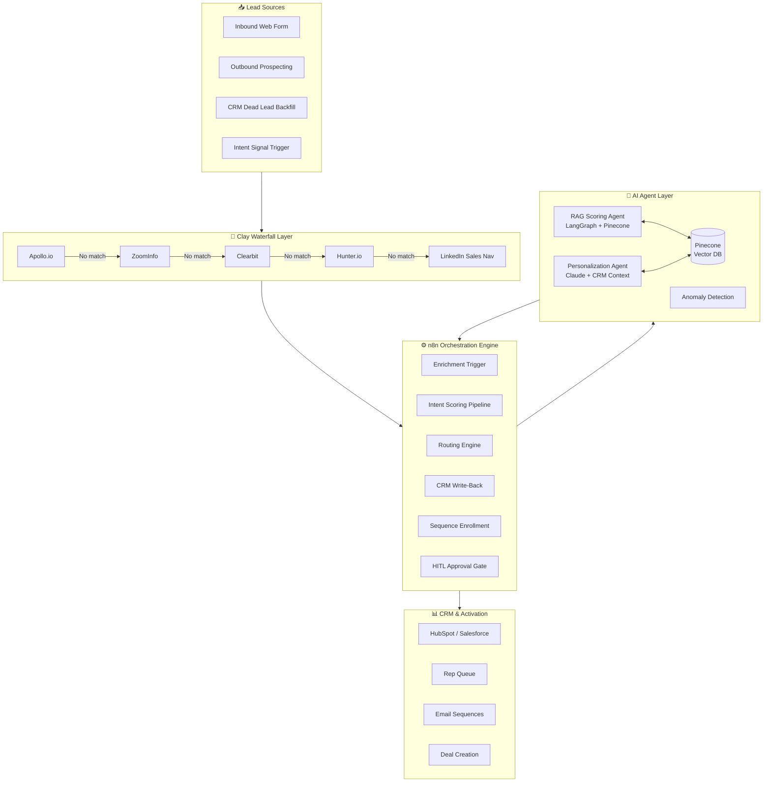
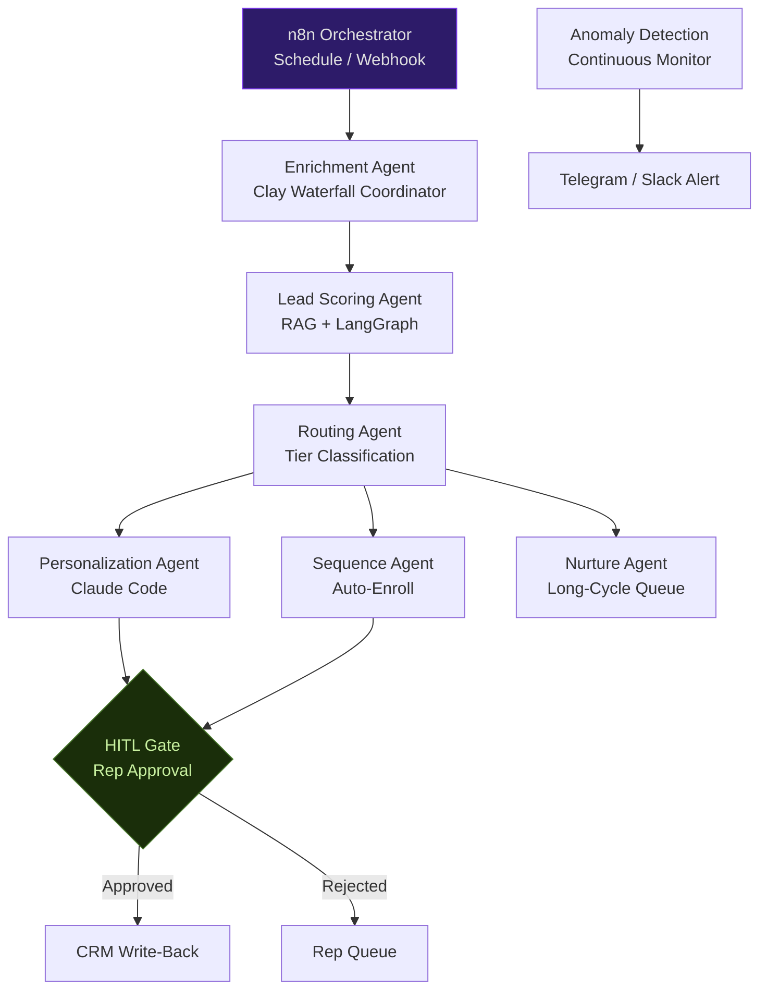
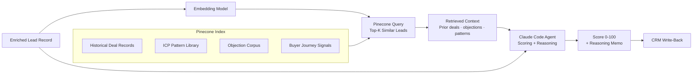
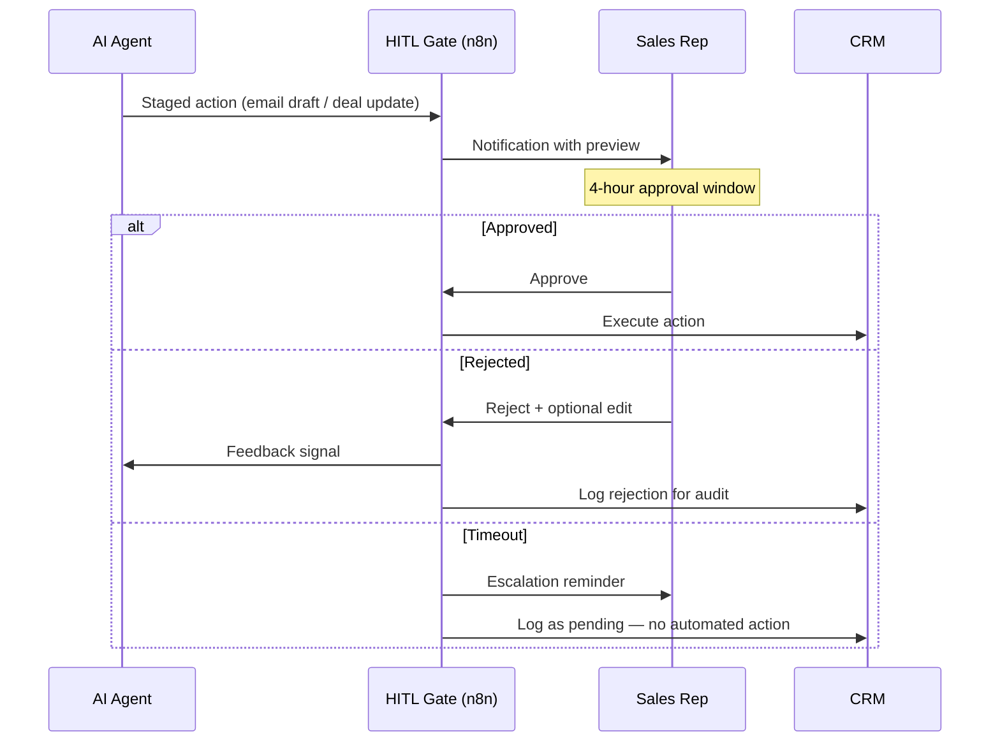
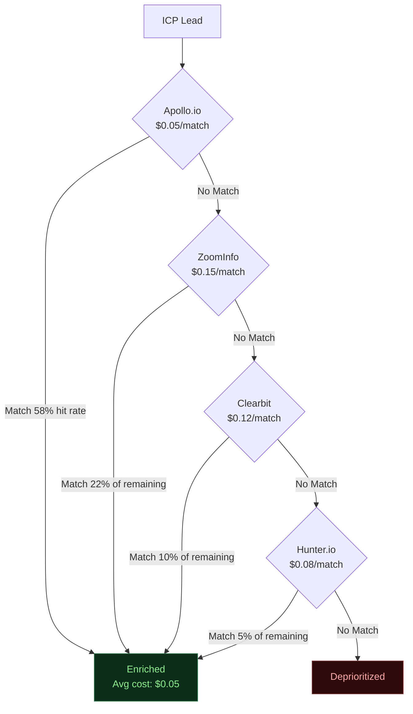

# Neural-GTM Sprint — System Architecture
**myAutoBots.AI | Full Technical Reference**

---

## 1. End-to-End Data Flow

---

## 2. Multi-Agent Orchestration

---

## 3. RAG Lead Scoring Architecture

---

## 4. HITL Approval Gate

---

## 5. Clay Waterfall Cost Model

Weighted avg cost per match: ~$0.08 vs $0.28 single-provider — **97% cost reduction at equal or higher coverage.**

---

## 6. Tech Stack Reference

| Component | Technology | Purpose |
|---|---|---|
| Enrichment | Clay (Waterfall) | Multi-provider cascade |
| Workflow Automation | n8n (50+ workflows) | End-to-end orchestration |
| Agent Framework | LangChain / LangGraph | Multi-agent coordination |
| Vector Database | Pinecone | RAG context retrieval |
| LLM | Claude (Anthropic) | Scoring, personalization, reasoning |
| CRM Integration | HubSpot / Salesforce APIs | Write-back and activation |
| Data Storage | Supabase / Airtable | Agent memory + state |
| HITL Interface | Slack / Telegram | Rep approval notifications |
| Infrastructure | Docker + Linux | Always-on execution |

---

*[Book a free 30-min discovery call](https://calendly.com/ssam8005/30min)*
