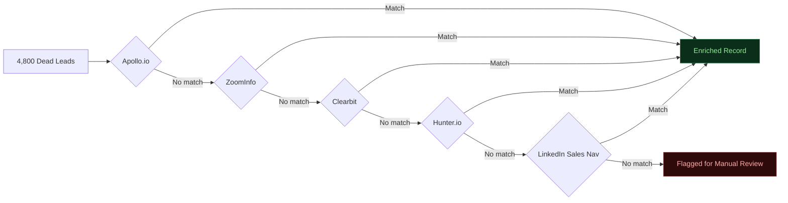

# Case Study: $1.4M Pipeline Recovery
## B2B SaaS — CRM Dead Lead Re-Engagement
*myAutoBots.AI | Client details anonymized per NDA*

---

## Client Profile

| | |
|---|---|
| **Industry** | B2B SaaS — Sales Enablement |
| **ARR at Engagement** | ~$3.2M |
| **Team Size** | 12 (4 AEs, 3 SDRs, 2 RevOps, 1 Marketing, 2 CS) |
| **CRM** | HubSpot |
| **Enrichment** | Apollo.io (single provider, no waterfall) |
| **Automation** | Zapier (5 basic zaps) |

---

## The Problem

4,800 contacts in HubSpot marked "Closed Lost" or "Dead Lead" — accumulated over 3 years. Estimated 60%+ had stale or missing contact data. No re-enrichment or re-engagement workflow had ever been deployed.

Apollo.io alone returned 58% match rate on their ICP (VP Sales / Head of Revenue, 20–200 employee SaaS companies). Leads outside Apollo's coverage were discarded.

**Monthly cost of inaction:**
`4,800 dead leads × 22% ICP match × 8% re-engagement response × 15% close rate × $22,000 ACV = ~$117,000/month`

---

## Diagnostic (Hours 0–8)

| Gap ID | Description | Monthly $ Impact | Priority |
|---|---|---|---|
| GAP-001 | Dead CRM leads — no re-enrichment or re-engagement | $117,000 | P1 |
| GAP-002 | Single-provider enrichment — 42% miss rate on ICP | $44,000 | P1 |
| GAP-003 | No lead scoring — all leads treated equally | $31,000 | P1 |
| GAP-004 | Manual sequence enrollment — 2–3 day lag | $18,000 | P2 |
| GAP-005 | No CRM write-back — data stays in Apollo | $12,000 | P2 |
| GAP-006 | No intent signals in scoring model | $9,000 | P3 |

**Total addressable monthly leakage: $231,000**

---

## The Sprint

### Clay Waterfall (Hours 8–24)

**Result:** 89% match rate — up from 58% with Apollo alone.

### n8n Workflows (Hours 24–56)

| Workflow | Function |
|---|---|
| Dead Lead Re-Enrichment Trigger | Clay Waterfall on all "Closed Lost" records, last activity >90 days |
| ICP Scoring Pipeline | 0–100 score: company size (25%), industry (20%), title (25%), tech stack (15%), history (15%) |
| Three-Tier Routing | Hot (70+) → SDR alert; Warm (40–69) → sequence; Cold (<40) → quarterly nurture |
| HubSpot Write-Back | All enrichment data, scores, tier assignments to custom HubSpot properties |
| HITL Gate | All re-engagement emails staged for SDR approval before send |
| Response Handler | Positive replies → new deal in HubSpot + AE notification + sequence cancel |

### AI Agent Layer (Hours 56–72)

RAG-backed scoring agent retrieved 90-day HubSpot context per lead before scoring — factoring in prior objections, pricing conversations, and decision-maker changes.

Personalization agent generated opening lines for top 200 hot leads, each referencing a current, specific signal (funding round, job change, product launch).

---

## Results (30 Days Post-Sprint)

| Metric | Before | After |
|---|---|---|
| CRM match rate | 58% | 89% |
| Dead leads re-enriched | 0 | 4,268 |
| Hot leads identified | 0 | 412 |
| SDR hours on manual triage | 14 hrs/week | 1.5 hrs/week |
| Pipeline created from dead leads | $0 | **$1.4M** |
| Sequence reply rate | N/A | 9.2% |

---

## What Made the Difference

1. **Waterfall over single-provider** — 31pt match rate increase unlocked ~600 ICP-matched leads Apollo would have missed
2. **RAG-backed scoring** — Agent caught 40+ leads that said "not now" but had since changed roles or companies
3. **HITL approval gate** — SDRs approved 94% of staged emails, building trust. Without it, adoption would have been lower

---

*[Book a free 30-min diagnostic](https://calendly.com/ssam8005/30min) to see what dead pipeline you have.*
