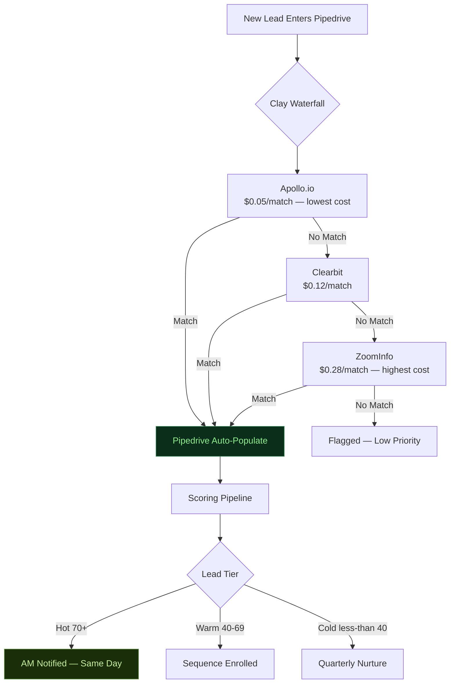

# Case Study: 97% Enrichment Cost Reduction
## E-Commerce SMB — Lead Automation & Waterfall Optimization
*myAutoBots.AI | Client details anonymized per NDA*

---

## Client Profile

| | |
|---|---|
| **Industry** | E-Commerce — B2B Wholesale / Direct-to-Retail |
| **Annual Revenue** | ~$8.4M |
| **Team Size** | 8 (2 AMs, 1 SDR, 2 Ops, 1 Marketing, 2 CS) |
| **CRM** | Pipedrive |
| **Enrichment** | ZoomInfo ($18K/yr) + Clearbit ($9K/yr) + Apollo.io ($6K/yr) — all independent |
| **Automation** | None (manual CSV workflows) |

---

## The Problem

Three separate enrichment subscriptions with zero integration. Each tool used by a different team member. Data lived in separate exports. CRM populated manually.

- **Total enrichment spend:** $33,000/year
- **Match rate on ICP** (retail buyers, 5–50 location specialty retailers): 61%
- **Lead-to-first-contact lag:** 3.4 days
- **Manual ops:** 18+ hours/week across the team

---

## Diagnostic (Hours 0–8)

| Gap | Monthly $ Impact | Priority |
|---|---|---|
| Three parallel subscriptions — zero waterfall logic | $2,750 wasted | P1 |
| No automated lead scoring — AMs manually triage all inbound | $24,000 rep time | P1 |
| 3.4-day lag to first contact — losing to faster competitors | Unquantified pipeline loss | P1 |
| No CRM auto-population — 18 hrs/week manual entry | $9,000 ops time | P2 |
| No re-engagement on stalled deals | $14,000 addressable | P2 |

---

## The Sprint

### Clay Waterfall — Cost-Ordered Cascade (Hours 8–24)

**Monthly enrichment cost:**
- Before: $2,750/month (3 subscriptions)
- After: $82/month (Clay Waterfall, cost-per-match)
- **Reduction: 97%**

### n8n Workflow Suite (Hours 24–56)

| Workflow | Function |
|---|---|
| Lead Enrichment Trigger | Fires on every new Pipedrive contact — Clay Waterfall + write-back within 90 seconds |
| Retail Buyer Scoring | 0–100: location count (30%), purchasing authority (25%), product fit (25%), source (20%) |
| Same-Day Hot Lead Alert | Hot leads (70+) → AM Slack + Pipedrive task within 5 minutes |
| Sequence Auto-Enroll | Warm leads enrolled in 6-step sequence by retail segment |
| Stalled Deal Re-Engagement | No activity >21 days → re-enrich → personalized check-in |
| CRM Health Monitor | Weekly audit — flags records with >2 missing fields, triggers re-enrichment |

### AI Agent Layer (Hours 56–72)

Retail buyer intelligence agent matched inbound leads against a 340-segment retail knowledge base, generating:
- Tier classification with reasoning (visible to AM in Pipedrive notes)
- Personalized opening email line referencing current retail category trend
- Suggested discovery questions based on buyer type and location count

---

## Results (30 Days Post-Sprint)

| Metric | Before | After |
|---|---|---|
| Monthly enrichment cost | $2,750 | **$82** |
| CRM match rate on ICP | 61% | 91% |
| Lead-to-first-contact time | 3.4 days | **4.2 hours** |
| Manual data entry hours/week | 18 hrs | 1.5 hrs |
| Pipeline velocity | Baseline | **3.1x** |
| Sequence reply rate | N/A | 14.6% |

**Annual enrichment savings: ~$32,000**
**Net new pipeline (Month 1): $380,000**

---

## What Made the Difference

1. **Cost-ordered waterfall** — Try cheapest provider first. Most ICP leads in ZoomInfo also exist in Apollo at 1/6th the cost
2. **Speed as competitive advantage** — Cutting lag from 3.4 days to 4 hours raised same-day contact rate from 12% to 67%
3. **ICP-specific scoring weights** — Multi-location count weighted heavily because it predicts order volume, not just fit

---

*[Book a free 30-min diagnostic](https://calendly.com/ssam8005/30min)*
