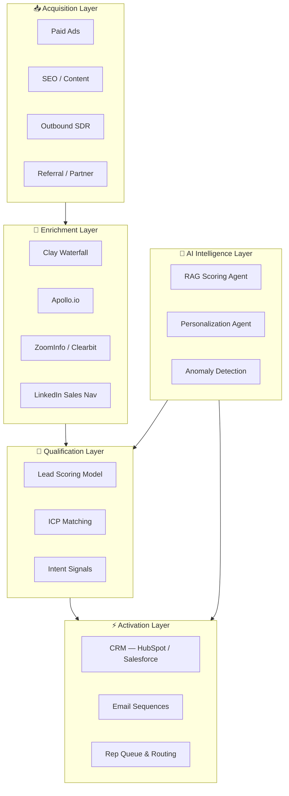
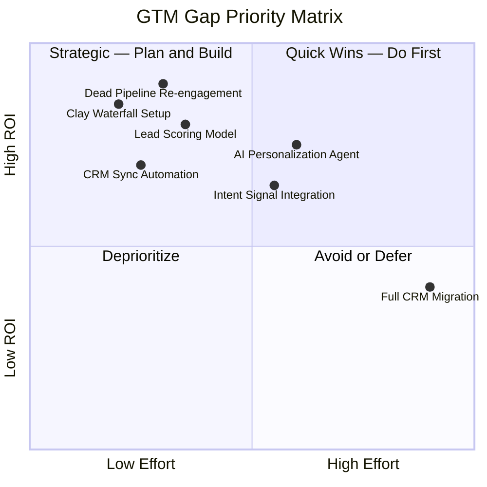

# GTM Stack Gap Analysis Framework
**Neural-GTM Sprint — Diagnostic Methodology**

---

## Overview

The Revenue Leakage Diagnostic runs during the first 8 hours of every Neural-GTM Sprint. It maps the complete GTM stack, identifies every point where revenue leaks, and assigns a dollar value to each gap.

---

## Step 1: Stack Topology Mapping



---

## Step 2: Leakage Point Identification

### Enrichment Leakage

| Issue | Signal | Typical Impact |
|---|---|---|
| Single-provider enrichment | <70% match rate on ICP | High — missing ICP leads entirely |
| No CRM backfill | Old records with no email/phone | Medium — dead pipeline untapped |
| No CRM write-back | Manual CSV exports | High — intent timing lost |
| No waterfall logic | Paying 3+ tools independently | Medium — cost waste + gaps |

### Qualification Leakage

| Issue | Signal | Typical Impact |
|---|---|---|
| No lead scoring | All leads treated equally | Very High — rep time on low-fit |
| Scoring disconnected from routing | Manual queue triage | High — high-intent leads go cold |
| ICP criteria informal | Reps filter differently | Medium — inconsistent pipeline |
| No intent signals in scoring | Firmographic only | Medium — timing misses |

### Activation Leakage

| Issue | Signal | Typical Impact |
|---|---|---|
| Manual sequence enrollment | Rep adds leads manually | Very High — follow-up gaps |
| Incomplete CRM fields | Missing title, company size | High — personalization fails |
| Dead leads never re-engaged | Closed lost, no re-enrichment | High — $1.4M median in dead pipeline |
| No HITL gate | AI sends without rep approval | Risk — brand / compliance exposure |

---

## Step 3: Dollar Quantification Model

```
Monthly Leakage = (Leads Lost/Month) × (ICP Match Rate) × (Avg Deal Value) × (Conversion Rate)
```

**Example — Dead CRM Pipeline gap:**
```
Dead leads in CRM:         2,400
ICP match rate:            22%
Re-engagement response:    8%
Average deal value:        $18,500
Close rate from response:  15%

Monthly addressable:       2,400 × 22% = 528 ICP-matched dead leads
Re-engagement pipeline:    528 × 8% = 42 responses/month
Monthly recovered ARR:     42 × $18,500 × 15% = $116,550/month
Annual recovered ARR:      ~$1.4M
```

---

## Step 4: Prioritization Matrix



---

## Step 5: Gap Report Format

Each gap documented as:

```
GAP-NNN: [Gap Name]
  Layer:          [Enrichment / Qualification / Activation / Intelligence]
  Current State:  [What is happening today]
  Desired State:  [What should happen after the sprint]
  Dollar Impact:  $X/month in recoverable revenue
  Root Cause:     [Technical / Process / Tool gap]
  Sprint Fix:     [Specific workflow or agent that resolves this]
  Effort:         [Hours — included in sprint scope]
  Priority:       [P1 / P2 / P3]
```

---

*[Book a free diagnostic call](https://calendly.com/ssam8005/30min) to see this applied to your stack.*
